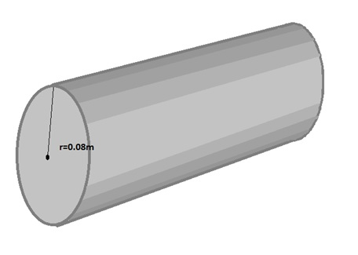

# Simulation of transient thermal processes
Heat is one of two ways of transmitting internal energy to the thermodynamic system.
Heat transport in solid bodies is carried out on the path of conduction. 
The exchange of heat always proceeds from a body with a temperature higher to the body at a lower temperature, according to the second law of thermodynamics.
In the problem discussed, heat is transmitted through conduction. This problem is solved using the finite element method.

The problem which simulation will deal with is hardening of steel in two centers - in water and in transformer oil.
Hardening of iron alloys is a type of heat treatment of iron alloys (for example steel), consisting in quick cooling of previously heated material.

